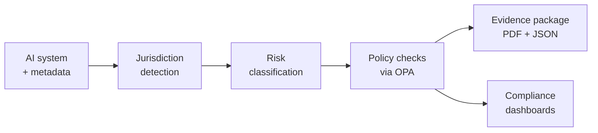

# AI Governance Console — Backend

[](LICENSE)
[](https://www.python.org/downloads/)
[](CODE_OF_CONDUCT.md)
[](CONTRIBUTING.md)

**Know which AI rules apply to your systems, prove you follow them, and generate the
evidence on demand.**

Organisations running AI systems face overlapping regimes — the EU AI Act, California's
ADMT rules, China's generative AI measures, India's DPDP Act — each with its own triggers,
risk tiers and obligations. Most teams track this in spreadsheets that go stale the moment
a system changes.

This is an open-source system that treats AI compliance as software. It keeps an
inventory of your AI systems, works out which jurisdictions apply and why, classifies risk
under each one, evaluates the systems against machine-readable policies, and produces
audit-ready evidence packages — with an immutable trail behind every decision.



> **Status:** v0.1.0, pre-1.0 and under active development. The API may change between
> minor versions. It is a governance record-keeping tool, **not legal advice** — every
> finding cites its source so a qualified human can verify it.

---

## Contents

- [Features](#features)
- [Quick start](#quick-start)
- [Authentication modes](#authentication-modes)
- [Response format](#response-format)
- [Supported jurisdictions](#supported-jurisdictions)
- [Architecture](#architecture)
- [Compliance model](#compliance-model)
- [Jurisdiction detection](#jurisdiction-detection)
- [Policies and OPA](#policies-and-opa)
- [Evidence packages](#evidence-packages)
- [API tour](#api-tour)
- [Auditability guarantees](#auditability-guarantees)
- [Audit log API](#audit-log-api)
- [Local development](#local-development-without-docker)
- [Project layout](#project-layout)
- [Testing](#testing)
- [Configuration](#configuration)
- [Operational notes](#operational-notes)
- [Contributing](#contributing)
- [Good first issues](#good-first-issues)
- [License](#license)

---

## Features

**AI system inventory**
- Full CRUD with soft delete and restore, so nothing is ever really lost
- Search and filter by status, owner, industry, use case, deployment region, jurisdiction
  and risk tier
- Complete version history: every change is snapshotted with a field-level diff and the
  person who made it

**Jurisdiction detection**
- Works out which regimes apply from deployment, market, data-subject, residency and
  reachability signals — including extraterritorial reach
- Explains *why* each one applies, in plain language, with machine-readable signals
  alongside
- Ranks regimes by strictness and tells you the order to assess them in
- Pure, dependency-free decision engine that is trivial to test and extend

**Risk classification**
- Global baseline scoring with per-jurisdiction overlays that only ever escalate
- Immutable history — re-running writes a new record, never overwrites one
- Flags systems whose metadata changed since they were last assessed

**Policy as code**
- Real Rego policies for the EU AI Act, evaluated by Open Policy Agent
- Every finding carries a rule ID, the article it comes from, its severity, a
  human-readable explanation and concrete remediation
- Degrades gracefully: declarative fallback when OPA is unreachable, and an explicit
  error result rather than a silently dropped check
- Add a jurisdiction or a rule without touching application code

**Evidence packages**
- One call generates a PDF report and a canonical JSON manifest, jurisdiction-specific
- Generated asynchronously, stored in S3-compatible object storage, checksummed

**Dashboards**
- Compliance status by jurisdiction, risk-tier distribution, recent failures, pending
  reviews and an overall score

**Optional authentication**
- JWT access + refresh tokens with three roles, or run with `AUTH_DISABLED=true` behind
  your own network boundary
- The audit trail works identically either way, marking unauthenticated actions as
  `system` so they are never indistinguishable from a person's

**Built to be operated**
- Request IDs on every request, structured JSON logs, Prometheus metrics, health and
  readiness probes, rate limiting on login and expensive endpoints, secure headers
- Audit tables that the database itself refuses to let you modify

---

## Quick start

You need [Docker](https://docs.docker.com/get-docker/) with Compose v2. Nothing else.

```bash
git clone https://github.com/OWNER/REPO.git && cd REPO
cp .env.example .env
docker compose up --build
```

That starts PostgreSQL, Redis, OPA (with the policies mounted), MinIO, the API, a Celery
worker and the scheduler. On first boot the API runs migrations, seeds baseline data and
pushes the policies into OPA.

| What | Where |
| --- | --- |
| API docs (Swagger) | <http://localhost:8000/docs> |
| API docs (ReDoc) | <http://localhost:8000/redoc> |
| Readiness probe | <http://localhost:8000/health/ready> |
| MinIO console | <http://localhost:9001> |
| OPA | <http://localhost:8181> |

Seeded demo logins, all with password `ChangeMe123!`:

| Email | Role | Can do |
| --- | --- | --- |
| `admin@aigov.example.com` | `admin` | everything, including policies and users |
| `risk@aigov.example.com` | `risk_officer` | inventory, classification, checks, evidence |
| `viewer@aigov.example.com` | `viewer` | read-only |

> Seeded before v0.1.0? Those accounts used `@aigov.local`, a reserved domain that
> cannot be used as an email address. Re-running the seeder (or restarting the API)
> renames them automatically — no need to drop your volume.

> These credentials are public and development-only. The application **refuses to start**
> in `staging` or `production` while any example secret is still in place, and the seeder
> will not create demo accounts outside `local`/`test`.

Try it end to end:

```bash
TOKEN=$(curl -s localhost:8000/api/v1/auth/login \
  -H 'content-type: application/json' \
  -d '{"email":"admin@aigov.example.com","password":"ChangeMe123!"}' | jq -r .access_token)

curl -s localhost:8000/api/v1/dashboard/summary \
  -H "authorization: Bearer $TOKEN" | jq
```

Ports are configurable — set `API_PORT`, `POSTGRES_PORT` and friends in `.env` if
something already owns 8000 or 5432.

---

## Authentication modes

Authentication is **optional by configuration**, because the two realistic deployments of
a compliance backend have genuinely different needs: a multi-team SaaS-style install needs
real accounts and roles, while a service reachable only from inside a locked-down VPC often
already has authentication at the network edge.

Both modes write the same audit trail. Turning authentication off changes *who* an action
is attributed to, never *whether* it is recorded.

### Production (recommended): `AUTH_DISABLED=false`

The default. Every mutating endpoint requires a bearer token and role checks are enforced.

```bash
AUTH_DISABLED=false
SECRET_KEY=<48+ random bytes>
ACCESS_TOKEN_EXPIRE_MINUTES=30
REFRESH_TOKEN_EXPIRE_DAYS=7
```

| Endpoint | Purpose |
| --- | --- |
| `POST /api/v1/auth/login` | exchange credentials for an access + refresh pair |
| `POST /api/v1/auth/refresh` | rotate an expired access token |
| `GET /api/v1/auth/me` | the current principal |
| `GET /api/v1/auth/mode` | which mode this server runs in (no auth required) |

Access tokens are short-lived (30 minutes by default) and refresh tokens last 7 days. A
refresh token is rejected wherever an access token is expected, and vice versa. Login and
refresh are rate limited, and failed attempts are written to the audit trail.

### Internal / VPC only: `AUTH_DISABLED=true`

No credentials are required. Every request is attributed to a reserved **system
principal** — a real, non-loginable user row with the address `system@ai-gov.internal`
and the admin role — so foreign keys and the audit trail stay valid.

```bash
AUTH_DISABLED=true
```

The server logs a loud, repeated warning at startup, `GET /health` reports
`"auth_enabled": false`, and every audit entry is stamped `actor_type=system`, so you can
always tell after the fact which actions were taken without authentication:

```bash
curl "localhost:8000/api/v1/audit-logs?actor_type=system" -H "authorization: Bearer $TOKEN"
```

#### Security implications — read before enabling

Turning authentication off means **anyone who can open a TCP connection to this port has
full administrative control**. Specifically:

- Any caller can read the entire AI system inventory, including metadata about
  unreleased systems and their compliance failures.
- Any caller can create, modify and soft-delete systems and policies, and can generate
  evidence packages — which are then presented as authentic compliance records.
- Any caller can read the complete audit trail, including who did what and from where.
- Attribution is lost. The audit trail can prove *that* something changed and from which
  IP, but not *which person* did it. In a regulated setting, that may itself be a finding.
- There is no per-user rate limiting to fall back on: limits become per IP only.

It is a reasonable choice when **all** of these hold:

- the service listens only on a private network you control, and that is enforced by a
  security group, network policy or firewall rule — not merely by convention;
- authentication and authorisation already happen at the edge (service mesh, an
  authenticating reverse proxy, mTLS);
- you accept that the audit trail attributes actions to `system` rather than to a person.

It is **not** appropriate for anything reachable from the public internet, for shared
staging environments, or for any deployment where "who changed this record" has to be
answerable. The application refuses to start in `staging` or `production` with the
published example secrets, but it deliberately does **not** refuse `AUTH_DISABLED=true` —
some VPC deployments legitimately need it. It logs an error-level warning instead.

### Roles

| Action | admin | risk_officer | viewer |
| --- | :---: | :---: | :---: |
| Manage users and policies | ✅ | ❌ | ❌ |
| Create / edit AI systems | ✅ | ✅ | ❌ |
| Trigger classification | ✅ | ✅ | ❌ |
| Run policy checks | ✅ | ✅ | ❌ |
| Generate evidence packages | ✅ | ✅ | ❌ |
| View everything | ✅ | ✅ | ✅ |
| View audit logs | ✅ | ❌ | ❌ |

With `AUTH_DISABLED=true` the principal holds the admin role, so every row above is
effectively ✅ for anyone who can reach the service.

---

## Response format

Every response under `/api/v1` uses the same envelope.

```json
{ "success": true, "data": { "id": "…", "name": "Resume Screening Assistant" } }
```

```json
{
  "success": false,
  "error": {
    "code": "UNAUTHORIZED",
    "message": "Authentication required.",
    "details": {},
    "request_id": "0f4b9a2e-6c2b-4f0e-9a4a-1c2b3d4e5f60"
  }
}
```

Error codes are stable `UPPER_SNAKE_CASE` strings — `UNAUTHORIZED`, `FORBIDDEN`,
`NOT_FOUND`, `CONFLICT`, `VALIDATION_ERROR`, `RATE_LIMITED`, `UPSTREAM_ERROR`,
`INTERNAL_ERROR` — safe to branch on in a client.

The operational endpoints (`/health`, `/ready`, `/metrics`) are deliberately **not**
wrapped: Kubernetes probes and Prometheus scrapers expect their own formats, and putting a
product envelope in front of them would break standard tooling.

Every response carries an `X-Request-ID` header, echoed from the request when you supply
one. The same value appears in every log line and on every audit entry, so one identifier
traces a request from client to log to audit trail.

---

## Supported jurisdictions

| Code | Jurisdiction | Regulation modelled | Strictness | Policies |
| --- | --- | --- | --- | --- |
| `EU` | European Union (EU + EEA) | EU AI Act, Reg. (EU) 2024/1689 | 100 | High-risk obligations, prohibited practices, transparency |
| `CN` | People's Republic of China | Interim Measures for Generative AI Services; PIPL; algorithm filing | 90 | — |
| `CA` | California, USA | California AI Transparency Act; CCPA/CPRA ADMT rules | 70 | — |
| `IN` | India | Digital Personal Data Protection Act 2023 | 60 | — |
| `GLOBAL` | Internal baseline | Organisation-wide AI governance policy | 10 | Transparency and vendor diligence |

**Strictness** decides which regime wins when obligations conflict. Detection and risk
classification work for every jurisdiction listed; the EU has the deepest policy coverage
so far, and the others currently classify without detailed rule sets. Filling those in is
some of the most valuable work available — see [Good first issues](#good-first-issues).

Adding a jurisdiction is a data change plus tests, documented step by step in
[CONTRIBUTING.md](CONTRIBUTING.md#adding-a-new-jurisdiction).

---

## Architecture

```
                    ┌────────────┐
   HTTP ──────────► │  FastAPI   │ ──── SQLAlchemy 2.0 ───► PostgreSQL
                    │  /api/v1   │
                    └─────┬──────┘
                          │  ├── httpx ──► Open Policy Agent  (policy evaluation)
                          │  ├── redis ──► Redis              (cache + rate limits)
                          │  └── celery ─► Redis broker
                          │                    │
                          │              ┌─────▼──────┐
                          │              │   Worker   │ ──► ReportLab ──► PDF
                          │              │  (Celery)  │ ──► boto3 ─────► S3 / MinIO
                          │              └────────────┘
```

| Concern | Choice |
| --- | --- |
| Web framework | FastAPI + Pydantic v2 |
| ORM / migrations | SQLAlchemy 2.0 (typed `Mapped[]`) + Alembic |
| Database | PostgreSQL 16 (JSONB, window functions, triggers) |
| Cache / broker | Redis 7 |
| Async work | Celery (+ beat for scheduled re-checks) |
| Policy engine | Open Policy Agent over its REST Data API |
| Documents | ReportLab (PDF) + canonical JSON manifest |
| Object storage | Any S3-compatible endpoint (MinIO locally) |
| Auth | JWT (python-jose) + bcrypt (passlib), RBAC |
| Observability | structlog JSON logs, correlation IDs, Prometheus `/metrics` |

Layering is strict: routers depend on services, services depend on models, and nothing
depends back up. The decision engines are pure functions over plain data, which is what
makes them cheap to test and safe to change.

---

## Compliance model

**Global baseline + regional overlays.** Risk is scored once from system metadata, then
each applicable jurisdiction re-maps that baseline through its own taxonomy.

1. **`JurisdictionEngine`** decides *which* regimes apply. It is a **pure** engine —
   no database, no network, no clock — so the whole decision surface is testable with
   plain dataclasses. It evaluates a set of `JurisdictionRule`s against a
   `SystemProfile` (a frozen, region-normalised snapshot of the metadata). See
   [Jurisdiction detection](#jurisdiction-detection) below.
2. **`RiskClassificationService`** computes a baseline 0–100 score and tier from weighted
   signals (biometrics, safety component, automated decisions, autonomy level, sensitive
   data categories, enumerated high-risk and prohibited use cases). Each jurisdiction's
   `risk_taxonomy` then escalates that tier — never downgrades it — and attaches the
   obligations that follow from it.
3. **`PolicyService`** picks the policies that apply to that jurisdiction *and* tier,
   builds an input document, and evaluates it in OPA. If OPA is unreachable it falls back
   to the policy's declarative `rules` document, so a check always produces an auditable
   record and the reason is recorded in `engine`.

Seeded jurisdictions: `GLOBAL` (always applicable baseline), `EU`, `CA` (California),
`CN`, `IN`.

## Jurisdiction detection

`app/services/jurisdiction_engine.py` is deliberately pure. Two thin adapters are the only
impure code: `SystemProfile.from_system()` reads an already-loaded ORM object, and
`load_engine(db)` runs the single query that fetches the configured jurisdictions.

**Triggers.** Every rule lists named triggers, resolved through `TRIGGER_REGISTRY`. Each
one is a pure function that either returns a reason or returns `None`, and they come in
two kinds:

- **nexus** — establishes jurisdiction on its own (deployment, offering, data subjects,
  data residency, reachability, consequential decisions);
- **amplifier** — never establishes jurisdiction, only raises confidence and adds
  reasoning once a nexus has already fired.

That split is the engine's main correctness property. Processing biometrics does not drag
the EU AI Act over a US-only system; it is recorded only once the EU already applies.

| Trigger | Kind | Fires when |
| --- | --- | --- |
| `deployment_nexus` | nexus | the system runs in the territory |
| `offering_nexus` | nexus | it is offered or marketed to users there |
| `data_subject_nexus` | nexus | data subjects are located there |
| `data_residency_nexus` | nexus | data is stored or processed there |
| `service_accessibility_nexus` | nexus | the service can be reached from there |
| `generated_content_accessibility_nexus` | nexus | generative output can be viewed there |
| `consequential_decision_nexus` | nexus | automated consequential decisions affect residents |
| `always_applicable` | nexus | the regime is an internal baseline |
| `biometric_processing`, `childrens_data`, `generative_ai_service` | amplifier | the corresponding metadata is set |

**Shipped rules.** EU (strictness 100) — deployment, offering, data subjects or residency
anywhere in the EU/EEA, plus consequential decisions about EU residents. CN (90) — the
above plus reachability from China and generative output viewable from China. CA (70) —
deployment or users in California, or automated consequential decisions about California
residents. IN (60) — users, data subjects or deployment in India. GLOBAL (10) — the
always-applicable internal baseline.

**Region normalisation** (`app/services/regions.py`) folds free-form input to canonical
codes before any rule sees it: `Germany`/`de` → `DE`, `California`/`us_ca` → `US-CA`,
`PRC` → `CN`, `worldwide` → `GLOBAL`. Group codes expand both ways, so a system in `DE`
matches the EU territory set and a declared `EU` matches `FR`. Explanations collapse the
27 member states back to `EU`. Bare `CA` is genuinely ambiguous — ISO says Canada, this
domain means California — so it resolves to California by an explicit, overridable
default, and Canada must be written `Canada` or `CA-COUNTRY`.

**Output.** `evaluate()` returns a `JurisdictionAssessment`: a verdict per regime
(applicable, confidence, ordered reasons, machine-readable signals, matched territories),
the recommended `evaluation_order` (strictest first), `most_restrictive` (every code
sharing the top strictness — ties are real and all must be satisfied),
`apply_most_restrictive`, and human-readable `conflict_notes`.
`get_most_restrictive_jurisdictions()` returns the priority list on its own.

```python
from app.services.jurisdiction_engine import JurisdictionEngine, SystemProfile

engine = JurisdictionEngine()                       # or JurisdictionEngine(my_rules)
assessment = engine.evaluate(
    SystemProfile(
        deployment_regions=frozenset({"US-NY"}),
        offered_in_regions=frozenset({"EU"}),
        service_accessible_regions=frozenset({"GLOBAL"}),
        use_case="employment_screening",
        makes_automated_decisions=True,
    )
)
assessment.evaluation_order              # ('EU', 'CN', 'GLOBAL')
engine.get_most_restrictive_jurisdictions(assessment)   # ['EU']
```

**Configuration.** Rules are data. `JurisdictionRule.from_config({...})` builds one from a
plain mapping and rejects unknown trigger names outright, while
`rules_from_jurisdiction_rows()` reads the `jurisdictions` table so regimes can be tuned
(`strictness`, `triggers`, `consequential_use_cases`, `territories`) without a deploy. A
stored config whose trigger names are unrecognised — for example a pre-2.0 row — falls
back to the built-in defaults with a warning rather than silently switching the
jurisdiction off.

**Reach metadata.** Applicability distinguishes where a system is *deployed* from where it
is *offered* (`offered_in_regions`), where it can be *reached*
(`service_accessible_regions`), and where its *output* can be viewed
(`content_accessible_regions`). Use `GLOBAL` for anything on the public internet.

## Policies and OPA

Rego lives on disk under `policies/` and is the source of record. Docker Compose mounts
the tree straight into OPA; `POST /api/v1/policies/sync-opa` pushes it over the REST API
for runtime edits (shared libraries first, then policies — a package importing
`data.aigov.eu.base` will not compile until the base package is loaded).

```
policies/
  common/
    aigov_common.rego          shared accessors, flags, finding and readiness helpers
  eu/
    eu_ai_act_base.rego        shared vocabulary — Annex III map, metadata accessors, no decisions
    eu_high_risk.rego          Chapter III Section 2 obligations
    eu_prohibited.rego         Article 5 prohibited practices
    eu_transparency.rego       Article 50 transparency duties
    *_test.rego                Rego unit tests
  global/
    global_transparency.rego   cross-jurisdiction baseline
```

| Key | Package | Severity | Applies to |
| --- | --- | --- | --- |
| `eu_ai_act_high_risk` | `aigov.eu.high_risk` | critical | EU, high/prohibited tiers |
| `eu_ai_act_prohibited` | `aigov.eu.prohibited` | critical | EU, all tiers |
| `eu_ai_act_transparency` | `aigov.eu.transparency` | medium | EU, all tiers |
| `global_transparency_baseline` | `aigov.global.transparency` | medium | GLOBAL, all tiers |

### Decision contract

Each package exposes a `result` document. Every rule that fires contributes one
violation carrying the fields the console renders:

```json
{
  "allow": false,
  "decision": "deny",
  "in_scope": true,
  "severity": "critical",
  "rule_ids": ["eu.high_risk.art_14.human_oversight_missing"],
  "violations": [
    {
      "rule_id": "eu.high_risk.art_14.human_oversight_missing",
      "article": "Art. 14",
      "severity": "critical",
      "msg": "No human oversight measures are documented. Art. 14 requires ...",
      "remediation": "Assign named oversight roles, document how reviewers interpret ..."
    }
  ]
}
```

`in_scope: false` is an explicit, reported pass ("not applicable to this system") rather
than a silent success — a minimal-risk internal tool is never told to run a conformity
assessment. `PolicyService` also accepts packages that expose only `allow`/`violations`,
or a bare boolean, so policy authors are not forced into this schema.

**Severity is taken from the finding, not the policy.** A policy registered `critical` that
raises only a `low` finding produces a `low` check, and the stored check severity is the
worst violation actually raised. Blocking severities (`critical`, `high`, `medium`) make a
denial a `fail`; `low` and `info` produce a `warning`.

### What the EU high-risk package checks

Scope is Annex III membership, a high/prohibited classification, or safety-component
status — with an Art. 6(3) derogation removing a system from scope when documented.

| Article | Rule | Severity |
| --- | --- | --- |
| Art. 9 | risk management system exists | critical |
| Art. 10 | training/validation/test data documented | high |
| Art. 10(5) | safeguards where special category data is processed | critical |
| Art. 11 | Annex IV technical documentation recorded | critical |
| Art. 12 | automatic logging enabled | high |
| Art. 13 | instructions for use published | medium |
| Art. 14 | human oversight documented; effective for autonomous systems; individual review route | critical / high |
| Art. 15 | accuracy metrics declared; adversarial robustness tested for biometrics | high |
| Art. 43 | conformity assessment completed | critical |
| Art. 49 | Annex III system registered in the EU database | high |
| Art. 72/73 | post-market monitoring plan; serious incident reporting | medium / high |
| Art. 25 | written agreement with upstream model providers | medium |
| Art. 27 | fundamental rights impact assessment where required | high |

Annex III use cases are mapped by point, so explanations cite the right one — an
employment screener is told it falls under "Annex III(4) — recruitment and selection of
natural persons" rather than a generic "high-risk".

### Testing the Rego

```bash
opa test policies/ -v
```

33 Rego unit tests cover each package directly. `tests/integration/test_opa_live.py` runs
the same scenarios through `PolicyService` against a live OPA and is skipped when none is
reachable:

```bash
opa run --server --addr localhost:8181 policies/
```

Add a policy without touching code by POSTing to `/api/v1/policies` with `rego_code`, then
calling `/api/v1/policies/sync-opa`.

## Evidence packages

`POST /systems/{id}/evidence` returns `202 Accepted` with a `package_id` and `poll_url`;
the Celery task then:

1. optionally re-runs policy checks,
2. assembles the canonical JSON document (system, metadata, classifications with full
   rationale, policy checks with remediation, optional change history, summary),
3. renders a jurisdiction-specific PDF — EU, California, China and India each get their own
   title, cited regulation and attestation text (`app/services/pdf.py`),
4. uploads both artefacts to S3 and records presigned URLs plus a SHA-256 checksum.

Poll `GET /systems/{id}/evidence/{package_id}` until `status` is `completed` or `failed`;
failures record `error_message`.

A package can be retried with `POST /systems/{id}/evidence/{package_id}/retry` if it
failed, or if it has been pending or running for longer than
`EVIDENCE_STALE_AFTER_SECONDS` (default 15 minutes). A scheduled task marks such stalled
packages failed automatically, so nothing sits on "Generating…" indefinitely.

## API tour

Everything lives under `/api/v1`. All mutating endpoints require a bearer token.

```bash
TOKEN=$(curl -s localhost:8000/api/v1/auth/login \
  -H 'content-type: application/json' \
  -d '{"email":"admin@aigov.example.com","password":"ChangeMe123!"}' | jq -r .access_token)
```

| Group | Endpoints |
| --- | --- |
| Auth | `POST /auth/login`, `POST /auth/refresh`, `GET /auth/me`, `GET /auth/mode`, `GET|POST /auth/users`, `PATCH /auth/users/{id}` |
| Inventory | `GET|POST /systems`, `GET|PATCH|DELETE /systems/{id}`, `POST /systems/{id}/restore`, `GET /systems/{id}/versions` |
| Classification | `POST /systems/{id}/classify`, `GET /systems/{id}/classifications` |
| Policy checks | `POST /systems/{id}/check-policies`, `GET /systems/{id}/policy-checks` |
| Evidence | `POST /systems/{id}/evidence`, `GET /systems/{id}/evidence`, `GET /systems/{id}/evidence/{package_id}` |
| Dashboard | `GET /dashboard/summary`, `/dashboard/by-jurisdiction`, `/dashboard/recent-failures`, `/dashboard/pending-reviews` |
| Policies (admin) | `GET|POST /policies`, `GET|PATCH|DELETE /policies/{id}`, `POST /policies/sync-opa`, `POST /policies/batch-check` |
| Jurisdictions | `GET|POST /jurisdictions`, `GET|PATCH /jurisdictions/{code}`, `GET /jurisdictions/detect/{system_id}` (dry run, persists nothing) |
| Audit | `GET /audit-logs`, `GET /audit-logs/{id}` (admin only) |
| Ops | `GET /health`, `/health/live`, `/ready`, `/health/ready`, `/metrics` |

A full walkthrough:

```bash
# 1. Register a system
SYSTEM=$(curl -s -X POST localhost:8000/api/v1/systems \
  -H "authorization: Bearer $TOKEN" -H 'content-type: application/json' -d '{
    "name": "Loan Decisioning Engine",
    "description": "Approves or declines consumer loan applications",
    "status": "active",
    "system_metadata": {
      "purpose": "Decide consumer loan applications",
      "use_case": "credit_scoring",
      "industry": "fintech",
      "autonomy_level": "human_on_the_loop",
      "data_categories": ["personal_data", "financial"],
      "deployment_regions": ["EU"],
      "data_subject_regions": ["EU", "IN"],
      "offered_in_regions": ["EU", "IN"],
      "service_accessible_regions": ["GLOBAL"],
      "makes_automated_decisions": true
    }
  }' | jq -r .id)

# 2. Dry-run jurisdiction detection (writes nothing)
curl -s localhost:8000/api/v1/jurisdictions/detect/$SYSTEM \
  -H "authorization: Bearer $TOKEN" | jq '.evaluation_order, .most_restrictive_jurisdictions'

# 3. Detect jurisdictions and classify risk (writes immutable classification rows)
curl -s -X POST localhost:8000/api/v1/systems/$SYSTEM/classify \
  -H "authorization: Bearer $TOKEN" -H 'content-type: application/json' -d '{}' \
  | jq '.jurisdictions.evaluation_order, .most_restrictive_tier'

# 4. Evaluate policies through OPA
curl -s -X POST localhost:8000/api/v1/systems/$SYSTEM/check-policies \
  -H "authorization: Bearer $TOKEN" -H 'content-type: application/json' \
  -d '{"reclassify": true}' | jq '.summary, .checks[].explanation'

# 5. Generate an evidence package (202 Accepted, then poll)
PKG=$(curl -s -X POST localhost:8000/api/v1/systems/$SYSTEM/evidence \
  -H "authorization: Bearer $TOKEN" -H 'content-type: application/json' \
  -d '{"include_history": true}' | jq -r .package_id)

curl -s localhost:8000/api/v1/systems/$SYSTEM/evidence/$PKG \
  -H "authorization: Bearer $TOKEN" | jq '.status, .file_url'
```

**Conventions.** List endpoints take `page`, `page_size`, `sort_by`, `sort_dir` and return
`{items, meta:{total,page,page_size,pages}}`. Inventory search additionally accepts `q`,
`status`, `owner_id`, `jurisdiction`, `risk_tier`, `industry`, `use_case`,
`deployment_region`, `uses_generative_ai`, `include_deleted`. Every error is the same
envelope:

```json
{"error": {"code": "not_found", "message": "AI system … not found.", "details": null,
           "correlation_id": "0f4b9a2e-…"}}
```

**Roles.** `viewer` reads; `risk_officer` also writes inventory, classifications, checks
and evidence; `admin` additionally manages policies, jurisdictions and users.

## Auditability guarantees

- **Immutable assessments.** `risk_classifications`, `policy_checks` and `audit_logs` are
  append-only — enforced by PostgreSQL triggers that reject `UPDATE` and `DELETE`, not just
  by convention. Re-running a check writes a new row; nothing is ever overwritten.
- **Soft deletes.** `users`, `ai_systems` and `policies` carry `is_deleted` / `deleted_at`,
  and systems can be restored. Because the append-only triggers also block cascading
  deletes, systems are soft-deleted only — the history always survives.
- **Version history.** Every inventory mutation writes a `system_metadata_versions`
  snapshot with a field-level diff and the actor; classifications record the
  `metadata_version` they were computed against, so the dashboard can flag systems whose
  metadata has changed since they were last assessed.
- **Audit trail.** `audit_logs` records entity, action, actor, correlation ID and changes
  for every create/update/delete, classification, policy check, evidence generation and
  login.
- **Correlation IDs.** Accepted or generated per request, attached to every log line, the
  audit trail and the `X-Correlation-ID` response header, and propagated into Celery tasks.

## Audit log API

`GET /api/v1/audit-logs` (admin only) searches the trail. Every entry records the actor,
the action, the resource, before/after values, and the request fingerprint (id, client IP,
user agent).

```bash
# Everything that touched one system
curl "localhost:8000/api/v1/audit-logs?resource_type=ai_system&resource_id=$SYSTEM" \
  -H "authorization: Bearer $TOKEN" | jq

# Every action taken while authentication was disabled
curl "localhost:8000/api/v1/audit-logs?actor_type=system" -H "authorization: Bearer $TOKEN"

# Trace one request end to end
curl "localhost:8000/api/v1/audit-logs?request_id=$REQUEST_ID" -H "authorization: Bearer $TOKEN"
```

Filters: `resource_type`, `resource_id`, `action`, `actor_id`, `actor_type`, `request_id`,
`since`, `until`. The table is append-only and enforced by database triggers, so there is
no update or delete route — and could not be one.

---

## Local development (without Docker)

Requires Python 3.12+, plus PostgreSQL, Redis, OPA and an S3-compatible store reachable
from your machine.

```bash
python -m venv .venv && source .venv/bin/activate
pip install -r requirements-dev.txt
cp .env.example .env
alembic upgrade head
python scripts/seed.py              # or: python -m scripts.seed
python scripts/sync_opa.py          # push Rego into a running OPA
uvicorn app.main:app --reload
```

In a second shell:

```bash
celery -A app.workers.celery_app.celery_app worker -Q aigov -l info
```

`make up | down | migrate | seed | api | worker | test | lint | fmt` wraps all of the above.

## Project layout

```
app/
  api/
    deps.py              DB session, current user, RBAC guards
    errors.py            Exception handlers → consistent error envelope
    middleware.py        Correlation ID + access logging
    rate_limit.py        SlowAPI limiter (Redis-backed)
    v1/router.py         Aggregate v1 router
    v1/routers/          auth, systems, policies, jurisdictions, dashboard, health
  core/                  config (pydantic-settings), logging, security, context, exceptions
  db/                    Base + mixins, engine/session, seed data
  models/                SQLAlchemy models and enums
  schemas/               Pydantic v2 request/response models
  services/              Inventory, JurisdictionEngine, Risk, Policy, OPA client,
                         Evidence, PDF, Storage, Dashboard, Audit, Cache, User
  workers/               Celery app + tasks
alembic/versions/        Migrations
policies/eu/             EU AI Act Rego (+ Rego unit tests)
policies/global/         Cross-jurisdiction baseline Rego
tests/unit, tests/integration
docker/                  Dockerfile + entrypoint
```

Layering is strict: routers depend on services, services depend on models, and nothing
depends back up.

## Testing

```bash
pytest                      # 178 tests (10 skip without OPA)
pytest --cov=app --cov-report=term-missing
ruff check app tests && mypy app
```

The jurisdiction engine and region normaliser are covered by pure tests that construct
dataclasses directly — no fixtures, no database — including one case per applicability rule
(EU/CA/CN/IN), amplifier-cannot-establish-jurisdiction regression guards, ordering and
tie-breaking, immutability and determinism, configurability, and tolerance of stale stored
config. The remaining unit tests run against an in-memory SQLite database (JSONB and UUID columns are compiled
down to portable types in `tests/conftest.py`), so no services are needed. Coverage
includes the jurisdiction engine, risk baseline and overlays, policy evaluation with a
faked OPA (pass, deny, declarative fallback, tier filtering), inventory CRUD/versioning,
JWT handling, evidence assembly and PDF rendering, and dashboard aggregation. The
integration suite drives the real ASGI app through `TestClient` to cover routing, auth,
RBAC and the error envelope.

Rego is verified twice: `opa test policies/` exercises the policy logic in its own
language, and the live-OPA suite exercises the whole path from input construction to
stored `PolicyCheck`. Two behaviours are PostgreSQL-only and therefore not exercised by the SQLite fixture:
JSONB containment filtering (`deployment_region`) and the append-only triggers. Point
`TEST_DATABASE_URL` at a real PostgreSQL instance to cover them.

## Configuration

All settings come from the environment (or `.env`) via `pydantic-settings`; see
`app/core/config.py` and `.env.example`.

| Variable | Default | Notes |
| --- | --- | --- |
| `ENVIRONMENT` | `local` | `local` \| `test` \| `staging` \| `production` |
| `AUTH_DISABLED` | `false` | `true` disables all authentication — see [Authentication modes](#authentication-modes) |
| `SECRET_KEY` | `change-me-in-production` | **must** be replaced outside local dev |
| `ACCESS_TOKEN_EXPIRE_MINUTES` | `30` | access token lifetime |
| `REFRESH_TOKEN_EXPIRE_DAYS` | `7` | refresh token lifetime |
| `POSTGRES_*` / `DATABASE_URL` | local defaults | `DATABASE_URL` wins if set |
| `REDIS_URL` | `redis://localhost:6379/0` | cache, rate limits, Celery broker |
| `OPA_URL` | `http://localhost:8181` | falls back to declarative rules if down |
| `S3_*` | MinIO defaults | any S3-compatible endpoint |
| `RATE_LIMIT_ENABLED` / `RATE_LIMIT_DEFAULT` | `true` / `120/minute` | per token, else per IP |
| `RATE_LIMIT_LOGIN` | `10/minute` | login and refresh |
| `RATE_LIMIT_EVIDENCE` | `20/hour` | evidence generation |
| `RATE_LIMIT_POLICY_CHECK` | `60/hour` | policy evaluation |
| `SECURITY_HEADERS_ENABLED` | `true` | CSP, nosniff, frame-deny, referrer policy |
| `LOG_JSON` / `LOG_LEVEL` | `true` / `INFO` | set `LOG_JSON=false` for console logs |
| `CACHE_TTL_SECONDS` | `300` | dashboard aggregate cache |

## Operational notes

- **Health.** `/health` and `/health/live` are liveness probes. `/health/ready` checks
  PostgreSQL, Redis, OPA and object storage; only the database is hard-required, since the
  others degrade gracefully — it returns `503` when the database is unreachable.
- **Metrics.** `/metrics` exposes the Prometheus registry.
- **Caching.** Dashboard aggregates are cached in Redis and invalidated on any mutation;
  pass `?refresh=true` to bypass. Celery beat also refreshes them every 5 minutes.
- **Scheduled work.** `recheck_all_systems` fans out per-system re-evaluation; wire it into
  `beat_schedule` in `app/workers/celery_app.py` to run continuous compliance.
- **Before production:** rotate `SECRET_KEY` and all seeded passwords, put TLS in front of
  the API, restrict `CORS_ORIGINS`, point `S3_*` at real storage with server-side
  encryption, and run at least two workers so evidence generation is not a single point of
  failure.

## Deliberate design decisions

- **Policy checks never silently fail.** If OPA is unreachable the service falls back to
  the policy's declarative rules and records `engine: "rules"`; if there are no rules
  either, the check is stored as `error` rather than being dropped.
- **Overlays only escalate.** A regional taxonomy can raise a tier or set a floor; it can
  never lower the global baseline, so "most restrictive" holds by construction.
- **Evidence is content-addressed.** Each package stores a SHA-256 over the PDF and JSON,
  so a downloaded package can be proven to match what the platform generated.
- **Immutability is enforced in the database,** not in the service layer, so it survives
  bugs, migrations and direct SQL access.

---

## Contributing

Contributions are very welcome, and not only code. Regulatory expertise is at least as
valuable here: if you know a regime well and can tell us what a rule gets wrong, that is a
real contribution.

Start with **[CONTRIBUTING.md](CONTRIBUTING.md)**, which covers the development setup,
branch naming, the PR process, code style, and step-by-step guides for
[adding a jurisdiction](CONTRIBUTING.md#adding-a-new-jurisdiction) and
[adding a policy](CONTRIBUTING.md#adding-or-changing-a-policy).

- **Bugs and features:** open an [issue](https://github.com/OWNER/REPO/issues/new/choose)
- **Security problems:** follow [SECURITY.md](SECURITY.md) — never a public issue
- **Behaviour:** [Code of Conduct](CODE_OF_CONDUCT.md) (Contributor Covenant 2.1)

```bash
make test      # pytest
make lint      # ruff + mypy
make fmt       # format and autofix
make opa-test  # Rego unit tests
```

---

## Good first issues

Scoped starting points. Each says where to look and what "done" means. Comment on the
corresponding issue to claim one, or open an issue if it does not exist yet.

| # | Task | Area | Where to start |
| --- | --- | --- | --- |
| 1 | **Add a jurisdiction: Brazil (LGPD)** — detection rule, region aliases, seed data, tests | Jurisdictions | Worked example in [CONTRIBUTING.md](CONTRIBUTING.md#adding-a-new-jurisdiction); copy the `IN` rule in `app/services/jurisdiction_engine.py` |
| 2 | **Region aliases** — `Deutschland`, `Bharat`, `USA-California` and other spellings users actually type | Detection | `app/services/regions.py`; add cases to `tests/unit/test_regions.py` |
| 3 | **Write the China generative-AI policy** — filing, security assessment, content labelling | Policy | Model it on `policies/eu/eu_transparency.rego`; needs Rego tests |
| 4 | **CSV export for the inventory** — `GET /api/v1/systems/export` streaming CSV | API | `app/api/v1/routers/systems.py`; reuse the existing filter dependency |
| 5 | **CI workflow** — GitHub Actions running `make lint`, `make test` and `opa test` | Tooling | New `.github/workflows/ci.yml`; the Makefile targets already exist |
| 6 | **Dashboard trend endpoint** — compliance score over time from the classification history | Dashboard | `app/services/dashboard.py`; classifications are already append-only, so the history is there |
| 7 | **Improve a policy explanation** — pick any finding whose wording would not help a compliance officer and rewrite it | Policy | `policies/eu/*.rego`; explanation quality is a real feature here |
| 8 | **Docstring and type coverage** — find a service with thin docstrings and fill them in | Docs | Anywhere under `app/services/` |

New to the codebase? Read
[`app/services/jurisdiction_engine.py`](app/services/jurisdiction_engine.py) first — it is
pure, self-contained and shows how the whole system thinks.

---

## License

Apache License 2.0 — see [LICENSE](LICENSE). You may use, modify and distribute this
commercially, provided you preserve the copyright and license notices and state your
changes.

## Disclaimer

This software helps organisations *track and document* their AI compliance work. It does
not provide legal advice and does not certify compliance with any regulation. Risk
classifications and policy results are generated from the metadata you supply and the
rules configured here; they should be reviewed by qualified people before you rely on
them. Always consult a lawyer for your specific circumstances.
